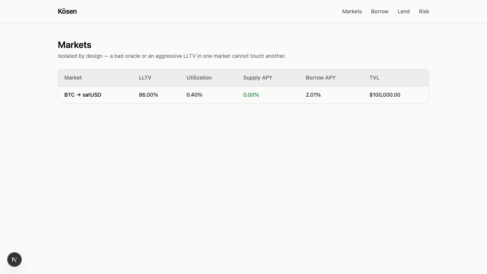
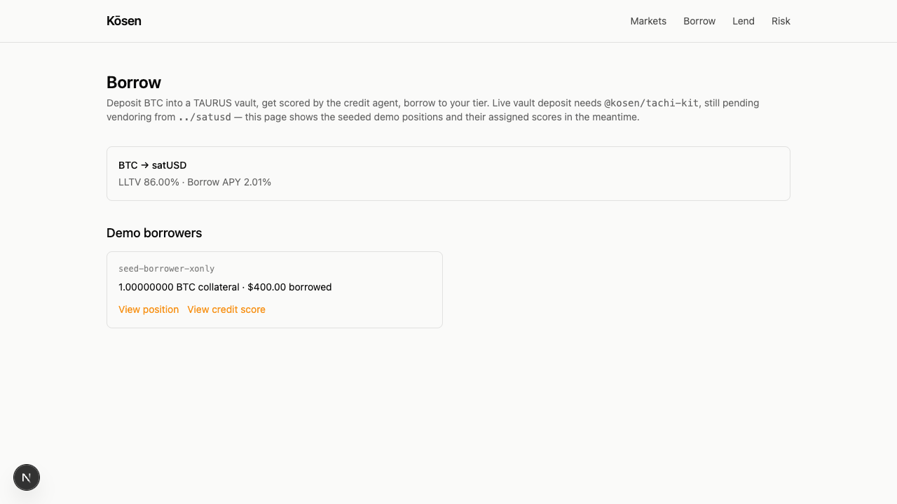
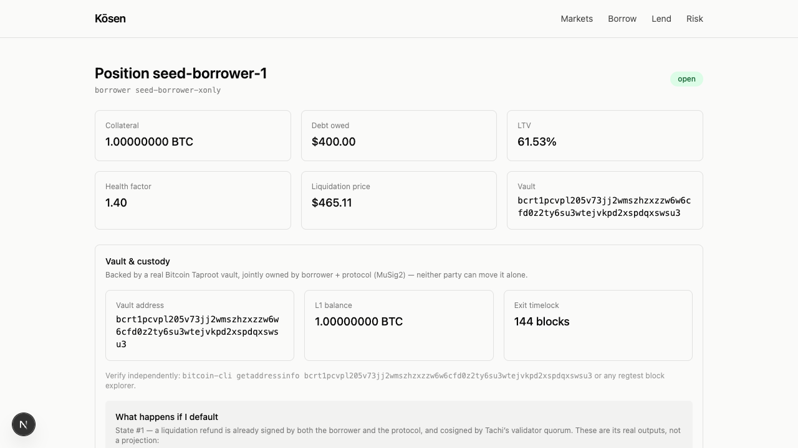
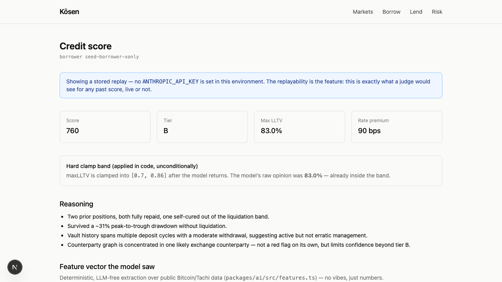
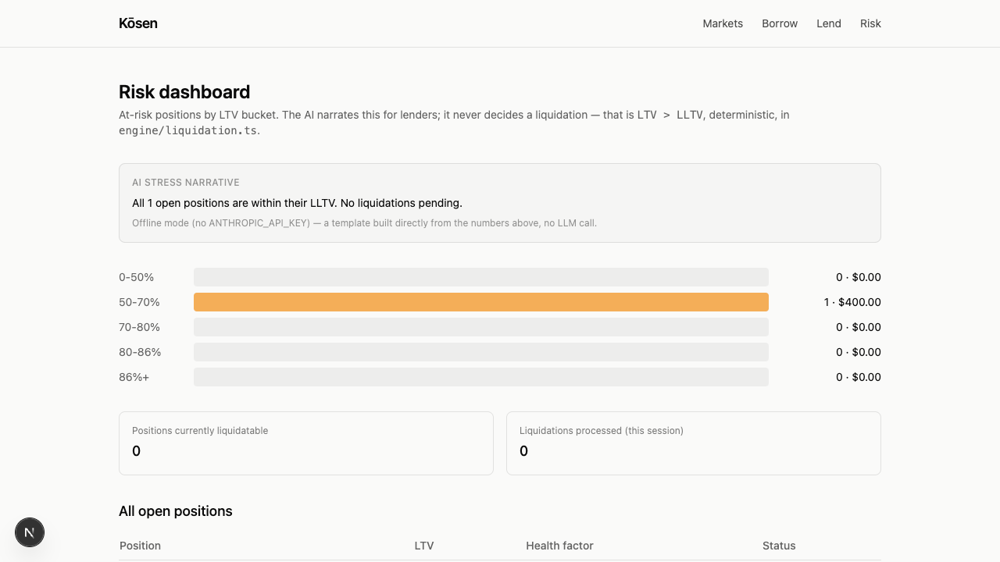
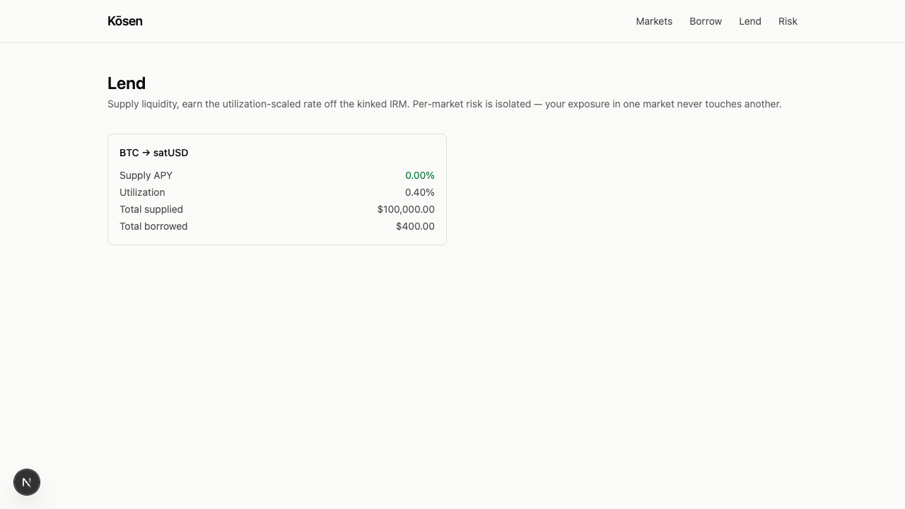
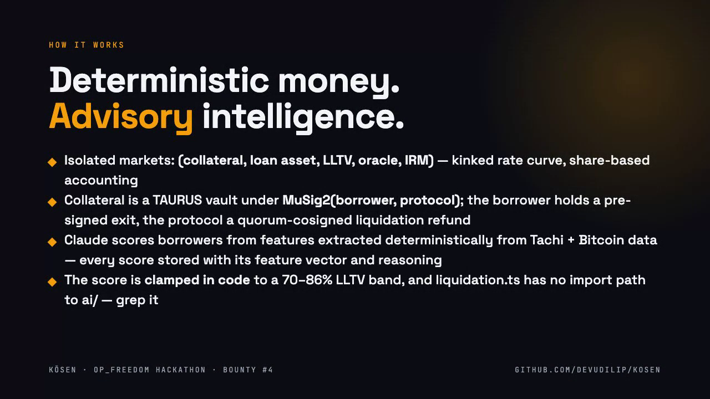
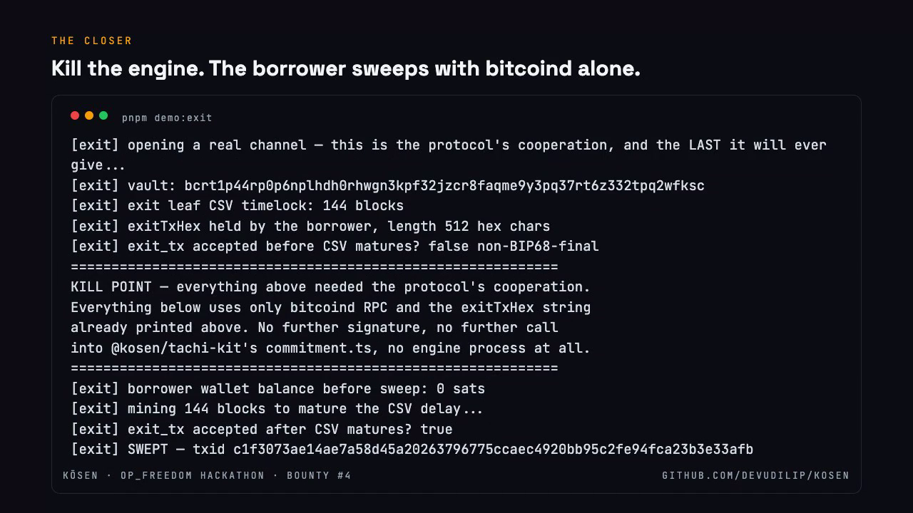
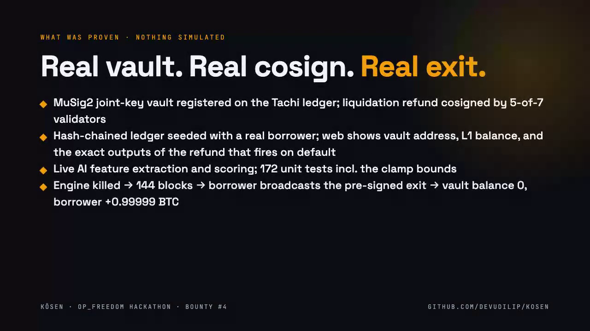
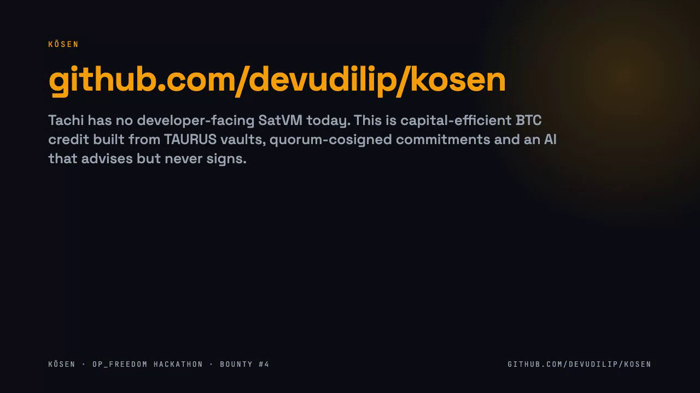

# Kōsen — demo

**Pitch (0:39):** [kosen-pitch-39s.mp4](https://github.com/devudilip/kosen/blob/main/demo/kosen-pitch-39s.mp4) — what it is and what problem it solves.

**Full demo (2:31):** [kosen-demo.mp4](https://github.com/devudilip/kosen/blob/main/demo/kosen-demo.mp4) — click to play in the browser.

Recorded 2026-10-03 with the engine in `KOSEN_MODE=tachi` (a real MuSig2 vault opened on `rpc-regtest.tachibtc.com` at startup) plus a local `bitcoind -regtest`, followed by `pnpm demo:exit`. Every txid shown is real.

## Screenshots

| | |
|---|---|
|  Markets |  Borrow |
|  Position — real vault address, L1 balance read from bitcoind, and the exact outputs of the refund that fires on default |  Credit score — replayable, hard-clamped, with the feature vector the model saw |
|  Risk dashboard — AI narrates, deterministic code decides |  Lend |
|  How it works |  The closer: engine killed, borrower sweeps with bitcoind alone |
|  What was proven |  |
